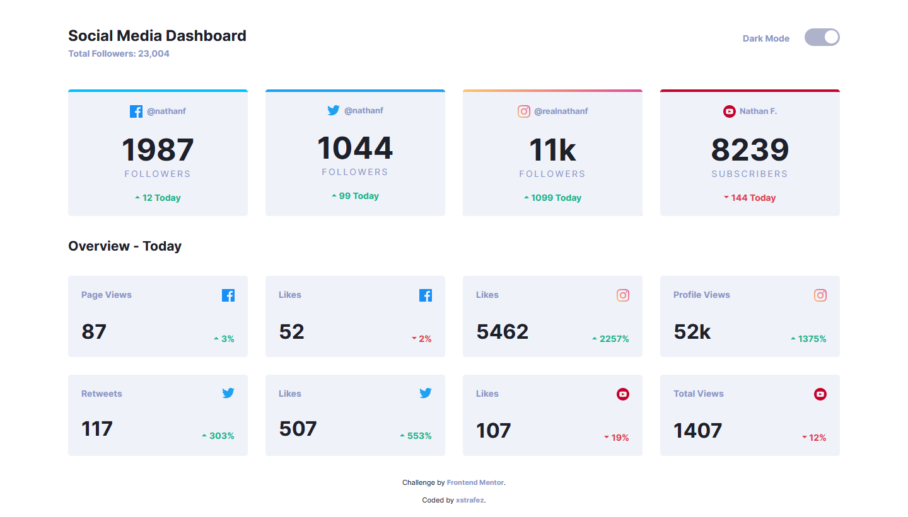
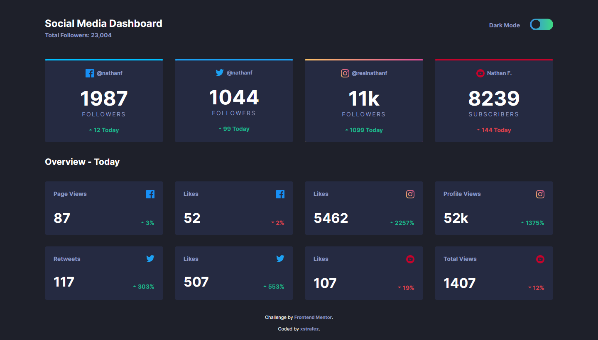
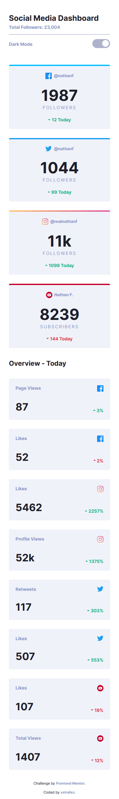
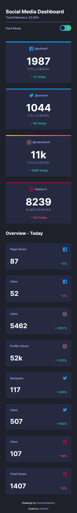

# Social Media Dashboard

This is my personal solution for the social-media-dashboard challenge by Frontend Mentor.

You can see the live version [here](https://social-media-dashboard.xstrafez.now.sh/ 'social-media-dashboard')

## Interactions

- Click on the switch to toggle between light and dark mode

## Technologies

- HTML
- CSS
- JavaScript

## Results

### Desktop Version

|                  Light Theme                  |               Dark Theme                |
| :-------------------------------------------: | :-------------------------------------: |
|  |  |

### Mobile Version

|                 Light Theme                  |               Dark Theme               |
| :------------------------------------------: | :------------------------------------: |
|  |  |

## See also

[Link to the challenge](https://www.frontendmentor.io/challenges/social-media-dashboard-with-theme-switcher-6oY8ozp_H)
